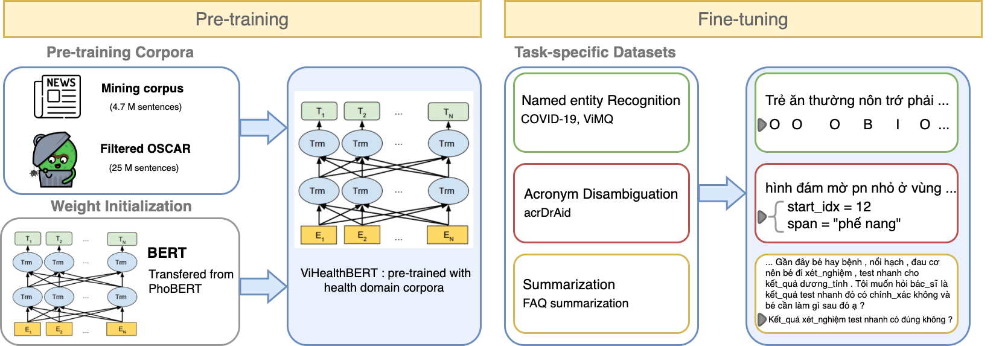

#### Table of contents
1. [Introduction](#introduction)
2. [Experimental Results](#result)
3. [Citation](#cite)
   
# <a name="introduction"></a> ViHealthBERT: Pre-trained Language Models for Vietnamese in Health Text Mining




ViHealthBERT is a strong baseline language models for Vietnamese in Healthcare domain.

 - We empirically investigate our model with different training strategies, achieving state of the art (SOTA) performances on 3 downstream tasks: NER (COVID-19 & ViMQ), Acronym Disambiguation, and Summarization.

 - We introduce two Vietnamese datasets: the acronym dataset (acrDrAid) and the FAQ summarization dataset in the healthcare domain. Our acrDrAid dataset is annotated with 135 sets of keywords.

Our work can be found in this [paper](http://www.lrec-conf.org/proceedings/lrec2022/pdf/2022.lrec-1.35.pdf) . The proceeding will soon be available from the ACL Anthology.


## <a name="result"></a> Experimental Results


| Model         |       Mac-F1*     |   Mic-F1*     |   Mac-F1**    |   Mic-F1**  |
| :---          |       :----:      |    :----:     |    :----:     |   :----:    |  
| PhoBERT-base  |       0.942       |   0.920       |   0.847       |   0.8224    |
| PhoBERT-large |       0.945       |   0.931       |   0.8524      |   0.8257    |
| ViHealthBERT  |       0.9677      |   0.9677      |   0.8601      |   0.8432    |

The overview of experimental results in COVID-19 and ViMQ datasets. * refers to COVID-19 dataset, ** refers to ViMQ dataset.

## <a name='hugging face'></a> Hugging face

Model | #params | Arch.  | Tokenizer
---|---|---|---
`demdecuong/vihealthbert-base-word` | 135M | base | Word-level
`demdecuong/vihealthbert-base-syllable` | 135M | base | Syllable-level

## <a name="cite"></a>
If you find our work is helpful, please cite 
```
@InProceedings{minh-EtAl:2022:LREC,
  author    = {Minh, Nguyen  and  Tran, Vu Hoang  and  Hoang, Vu  and  Ta, Huy Duc  and  Bui, Trung Huu  and  Truong, Steven Quoc Hung},
  title     = {ViHealthBERT: Pre-trained Language Models for Vietnamese in Health Text Mining},
  booktitle      = {Proceedings of the Language Resources and Evaluation Conference},
  month          = {June},
  year           = {2022},
  address        = {Marseille, France},
  publisher      = {European Language Resources Association},
  pages     = {328--337},
  url       = {https://aclanthology.org/2022.lrec-1.35}
}
```
**Please cite** our repo when it is used to help produce published results or is incorporated into other software.

## contact
nguyenphucminh2804@gmail.com


